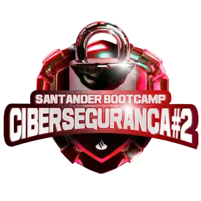

<pre style="font-size: 0.6rem;">

                              \\\\\\
                           \\\\\\\\\\\\
                          \\\\\\\\\\\\\\\
-------------,-|           |C>   // )\\\\|    .o88b. db   db  .d8b.  db    db  .d8b.  d888888b d888888b d88888b
           ,','|          /    || ,'/////|   d8P  Y8 88   88 d8' '8b 88    88 d8' '8b '~~88~~' '~~88~~' 88'  
---------,','  |         (,    ||   /////    8P      88ooo88 88ooo88 Y8    8P 88ooo88    88       88    88ooooo 
         ||    |          \\  ||||//''''|    8b      88~~~88 88~~~88 '8b  d8' 88~~~88    88       88    88~~~~~ 
         ||    |           |||||||     _|    Y8b  d8 88   88 88   88  '8bd8'  88   88    88       88    88.   
         ||    |______      ''''\____/ \      'Y88P' YP   YP YP   YP    YP    YP   YP    YP       YP    Y88888P
         ||    |     ,|         _/_____/ \
         ||  ,'    ,' |        /          |                 ___________________________________________
         ||,'    ,'   |       |         \  |              / \                                           \ 
_________|/    ,'     |      /           | |             |  |                                            | 
_____________,'      ,',_____|      |    | |              \ |      chavatte@duck.com                     | 
             |     ,','      |      |    | |                |                        chavatte.42web.io   | 
             |   ,','    ____|_____/    /  |                |    ________________________________________|___
             | ,','  __/ |             /   |                |  /                                            /
_____________|','   ///_/-------------/   |                 \_/____________________________________________/ 
              |===========,'                                                                                
			  

</pre>

# **Bootcamp - Santander Cibersegurança #2**

Este repositório contém os projetos desenvolvidos durante o Bootcamp Santander Cibersegurança #2 de 2024. Aqui, você encontrará soluções práticas para os desafios mais comuns em segurança da informação, desde a identificação de vulnerabilidades em sistemas até a implementação de medidas de proteção robustas.

## Objetivo

Desenvolver profissionais capazes de proteger sistemas e dados contra ameaças cibernéticas, utilizando as mais recentes técnicas e ferramentas do mercado.

## Conteúdo Programático

* **Fundamentos de Cibersegurança:** Conceitos básicos, tipos de ataques, legislação.
* **Hacking Ético e Testes de Penetração:** Metodologias, ferramentas e técnicas para avaliar a segurança de sistemas.
* **Redes e Protocolos:** Funcionamento de redes, protocolos de comunicação e segurança.
* ****Sistemas Operacionais**:** Configuração segura de sistemas operacionais (Linux, Windows).
* **Programação para Cibersegurança:** Desenvolvimento de ferramentas e scripts para automação de tarefas e análise de dados.

## **Projetos**

### [LAB-01: Criação de um Phishing com o Kali Linux](./projects/LAB-01/README.md)

### [LAB-02:  Entendendo um Ransomware na Prática com Python](./projects/LAB-02/README.md)

## Certificado de conclusão

 🎓 [Santander Bootcamp Cibersegurança #2]()
