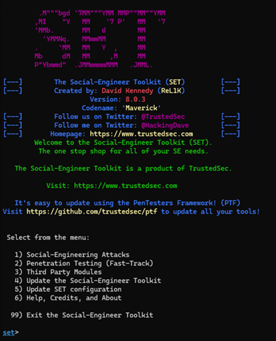
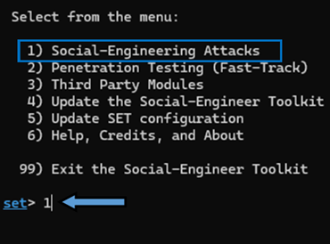
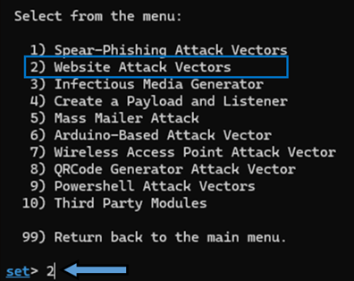
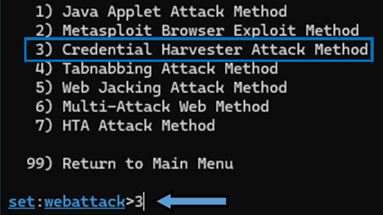
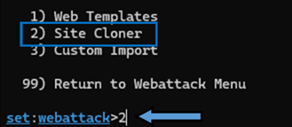
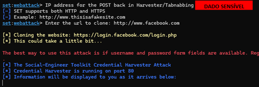
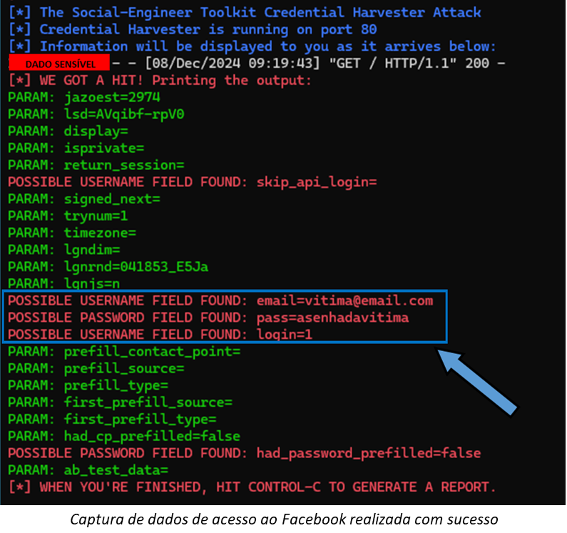

# LAB-01: Criação de um Phishing com o Kali Linux

## Resumo

Este laboratório apresenta um guia prático para a configuração de um ataque de phishing utilizando a ferramenta **setoolkit** no sistema operacional **Kali Linux**. O objetivo é simular um ataque real contra a plataforma Facebook, com o intuito de capturar credenciais de login dos usuários. Serão abordados os seguintes tópicos: utilização da ferramenta setoolkit, criação de um site clonado do Facebook e a coleta das credenciais dos usuários que acessarem o site falso.

***É IMPORTANTE RESSALTAR QUE ESTE LABORATÓRIO TEM FINS EXCLUSIVAMENTE EDUCACIONAIS E QUE A REALIZAÇÃO DE ATAQUES REAIS A SISTEMAS COMPUTACIONAIS É ILEGAL.***

## Phishing para Captura de Senhas do Facebook: Uma Simulação Prática

### Introdução

O phishing é uma das principais ameaças à segurança da informação na atualidade. Através de técnicas de engenharia social, os atacantes induzem as vítimas a fornecerem informações confidenciais, como senhas e dados bancários. Neste laboratório, utilizaremos a ferramenta setoolkit, presente na distribuição Kali Linux, para simular um ataque de phishing direcionado ao Facebook.

### Ferramentas

* **Kali Linux:** Distribuição Linux focada em testes de penetração e segurança da informação.
* **setoolkit:** Conjunto de ferramentas para realizar ataques de engenharia social.

### Configuração do Phishing no Kali Linux

* **Acesso root**

```
sudo su
```

* **Iniciando o setoolkit**

```
setoolkit
```



### Seleção, Configuração e Execução do Ataque

* **Social-Engineering Attacks**



* **Web Site Attack Vectors**



* **Credential Harvester Attack Method**



* **Site Cloner**



* **Definição da URL e execução do ataque de phishing**



* **Captura dos dados de Login do Facebook**



### Conclusão

Este laboratório apresentou uma introdução à configuração de ataques de phishing utilizando a ferramenta setoolkit. Através da simulação de um ataque ao Facebook, foi possível demonstrar a facilidade com que as credenciais de usuários podem ser comprometidas. É fundamental que os profissionais de segurança da informação estejam cientes das técnicas utilizadas pelos atacantes e que as empresas invistam em soluções para proteger seus sistemas e dados.

## Observações e Considerações

* **Legalidade:** É fundamental ressaltar que a realização de ataques a sistemas computacionais é ilegal e pode resultar em consequências jurídicas. Este laboratório tem como objetivo exclusivamente educacional e demonstrativo.
* **Ética:** A prática de phishing viola a privacidade dos usuários e pode causar danos financeiros e emocionais. É importante utilizar as ferramentas de segurança de forma responsável e ética.
* **Prevenção:** Para se proteger contra ataques de phishing, é recomendado que os usuários estejam atentos a e-mails suspeitos, links desconhecidos e sites que solicitam informações pessoais. A utilização de senhas fortes e de um software antivírus também são medidas importantes.
